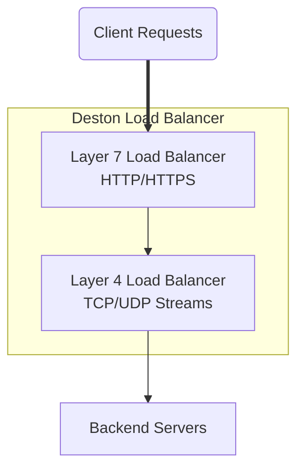

# Deston - A Rust-based L7 & L4 Load Balancer

# Deston - A Rust-based L7 & L4 Load Balancer

[](https://github.com/pushkar-gr/Deston/actions)
[](LICENSE)
[](https://www.rust-lang.org)
[](https://github.com/pushkar-gr/Deston/issues)
[](https://github.com/pushkar-gr/Deston/graphs/contributors)

Deston is an advanced Layer 4 (L4) and Layer 7 (L7) load balancer built with Rust. It provides robust performance, scalability, and fine-grained control for managing high-volume traffic across backend server infrastructures.

---

## ✨ Features

- **Dual support** for L4 and L7 load balancing.
- **Modular Design**: Clean separation of concerns using Rust modules (`config`, `server`, `load_balancer`).
- **Highly Scalable**: Built with `tokio` for asynchronous, non-blocking server connections.
- **Pluggable Algorithms**:
  - Round Robin
  - Weighted Round Robin
  - IP Hashing
- **Smart Server Health Checks**: Tracks response time, active connections, etc.
- **Customizable**:
  - Easy configuration through `config.toml`.
  - Supports dynamic addition of backend servers.

---

## 🎯 Project Architecture and Workflow

### High-Level Overview of Deston's Functionality:



1. Accepts client requests, either HTTP (Layer 7) or generic TCP/UDP streams (Layer 4).
2. Forwards the traffic to backend servers after running load-balancing algorithms.
3. Continuously monitors backend server health and adjusts routing dynamically.

---

## 🚀 Quick Start

### Prerequisites

- Rust 1.70+ (Install from [rustup](https://rustup.rs))
- Ensure `cargo` is available for building and running.

### Build

```bash
cargo build --release
```

### Run

```bash
cargo run --release
```

### Configuration

Modify `config.toml` to add servers, specify load-balancing algorithms, etc.:

```toml
[load_balancer]
address = "127.0.0.1"
port = 8080
algorithm = "RoundRobin"

[[server]]
address = "http://127.0.0.1:3000"
port = 3000

[[server]]
address = "http://127.0.0.1:3001"
port = 3001
```

---

## 📜 Code Snippets

Here is a glimpse of some of Deston's key components:

### Layer 4 Load Balancing

```rust
pub struct Layer4 {
    config: SyncConfig,
}

impl load_balancer::LoadBalancer for Layer4 {
    async fn start(&self) -> Result<(), Box<dyn std::error::Error + Send + Sync>> {
        let lb_address = "http://127.0.0.1:8000".parse::<Uri>().unwrap();
        let listener = TcpListener::bind((host, port)).await?;

        loop {
            let (stream, addr) = listener.accept().await?;
            tokio::task::spawn(async move { ... });
        }
    }
}
```

---

## 🛠️ Contributors

Deston warmly welcomes contributors! 🚀

- To get involved, see [`CONTRIBUTING.md`](./CONTRIBUTING.md) (if available).
- Report issues or suggest new features via [GitHub Issues](https://github.com/pushkar-gr/Deston/issues).

---

## 📄 License

This repository is licensed under the MIT License. See the [LICENSE](./LICENSE) file for more details.

---

## 🌟 Acknowledgements

Built using:

- [Tokio](https://tokio.rs) for asynchronous runtime.
- [Hyper](https://hyper.rs) for HTTP requests handling.

[](https://github.com/pushkar-gr/Deston/actions)
[](LICENSE)
[](https://www.rust-lang.org)
[](https://github.com/pushkar-gr/Deston/issues)
[](https://github.com/pushkar-gr/Deston/graphs/contributors)

Deston is an advanced Layer 4 (L4) and Layer 7 (L7) load balancer built with Rust. It provides robust performance, scalability, and fine-grained control for managing high-volume traffic across backend server infrastructures.

---

## ✨ Features

- **Dual support** for L4 and L7 load balancing.
- **Modular Design**: Clean separation of concerns using Rust modules (`config`, `server`, `load_balancer`).
- **Highly Scalable**: Built with `tokio` for asynchronous, non-blocking server connections.
- **Pluggable Algorithms**:
  - Round Robin
  - Weighted Round Robin
  - IP Hashing
- **Smart Server Health Checks**: Tracks response time, active connections, etc.
- **Customizable**:
  - Easy configuration through `config.toml`.
  - Supports dynamic addition of backend servers.

---

## 🎯 Project Architecture and Workflow

### High-Level Overview of Deston's Functionality:


1. Accepts client requests, either HTTP (Layer 7) or generic TCP/UDP streams (Layer 4).
2. Forwards the traffic to backend servers after running load-balancing algorithms.
3. Continuously monitors backend server health and adjusts routing dynamically.

---

## 🚀 Quick Start

### Prerequisites

- Rust 1.70+ (Install from [rustup](https://rustup.rs))
- Ensure `cargo` is available for building and running.

### Build

```bash
cargo build --release
```

### Run

```bash
cargo run --release
```

### Configuration

Modify `config.toml` to add servers, specify load-balancing algorithms, etc.:

```toml
[load_balancer]
address = "127.0.0.1"
port = 8080
algorithm = "RoundRobin"

[[server]]
address = "http://127.0.0.1:3000"
port = 3000

[[server]]
address = "http://127.0.0.1:3001"
port = 3001
```

---

## 📜 Code Snippets

Here is a glimpse of some of Deston's key components:

### Layer 4 Load Balancing

```rust
pub struct Layer4 {
    config: SyncConfig,
}

impl load_balancer::LoadBalancer for Layer4 {
    async fn start(&self) -> Result<(), Box<dyn std::error::Error + Send + Sync>> {
        let lb_address = "http://127.0.0.1:8000".parse::<Uri>().unwrap();
        let listener = TcpListener::bind((host, port)).await?;

        loop {
            let (stream, addr) = listener.accept().await?;
            tokio::task::spawn(async move { ... });
        }
    }
}
```

---

## 🛠️ Contributors

Deston warmly welcomes contributors! 🚀

- To get involved, see [`CONTRIBUTING.md`](./CONTRIBUTING.md) (if available).
- Report issues or suggest new features via [GitHub Issues](https://github.com/pushkar-gr/Deston/issues).

---

## 📄 License

This repository is licensed under the MIT License. See the [LICENSE](./LICENSE) file for more details.

---

## 🌟 Acknowledgements

Built using:

- [Tokio](https://tokio.rs) for asynchronous runtime.
- [Hyper](https://hyper.rs) for HTTP requests handling.
